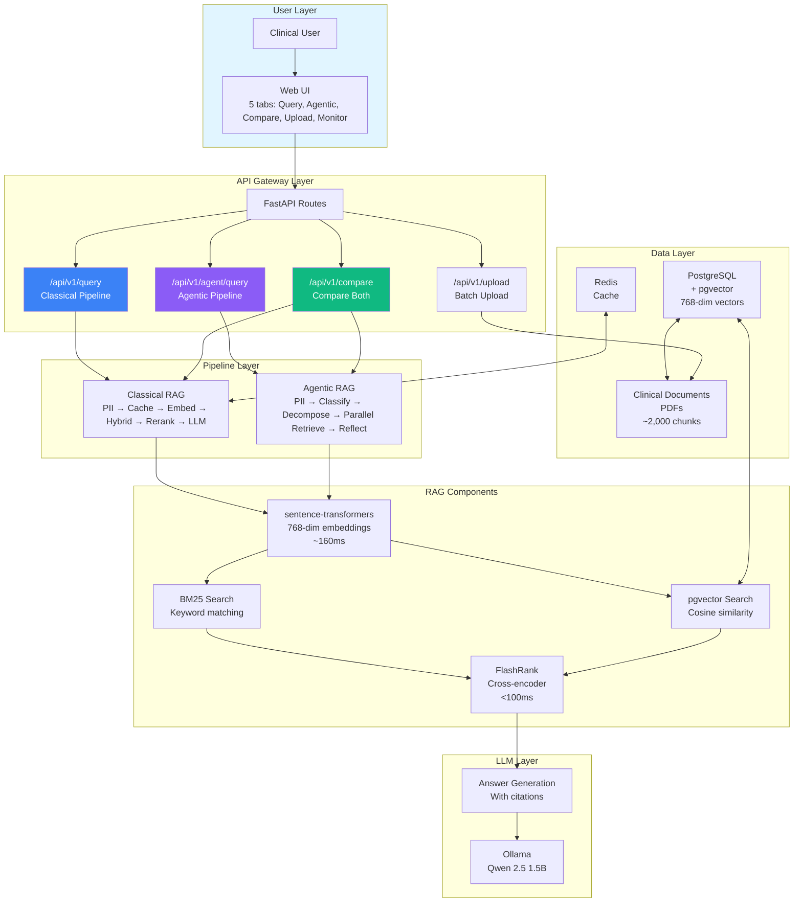

# KaagapAI Architecture Documentation

## Overview

KaagapAI implements dual RAG (Retrieval-Augmented Generation) pipelines optimized for clinical documentation retrieval:

1. **Classical RAG**: Fast, single-pass hybrid retrieval with reranking (<2s latency)
2. **Agentic RAG**: ReAct-style reasoning with query decomposition for complex queries (3-5s latency)

## Architecture Diagrams

### Pipeline Flows

- **[Classical RAG Flow](./classical-rag-flow.md)** - Detailed flowchart and explanation of the classical pipeline
- **[Agentic RAG Flow](./agentic-rag-flow.md)** - Detailed flowchart and explanation of the agentic pipeline
- **[Pipeline Comparison](./pipeline-comparison.md)** - Side-by-side comparison, routing strategies, use cases

### Quick Visual Reference



## System Components

### 1. Pipeline Layer

**Classical RAG Pipeline** (`src/pipelines/classical.py`)
- **Purpose**: Fast, single-concept clinical queries
- **Flow**: PII redact → cache check → embed → hybrid retrieve → entity boost → rerank → synthesize → extractive fallback
- **Enhancements**: Multi-query retrieval (opt-in), entity-aware boosting, context window expansion (opt-in), extractive fallback, web search fallback
- **Performance**: <2s (p95), <200ms cached
- **Use Cases**: Simple fact lookups, single contraindications, dosage queries

**Agentic RAG Pipeline** (`src/pipelines/agentic.py`)
- **Purpose**: Complex, multi-part clinical queries requiring reasoning
- **Flow**: Classify → decompose → parallel retrieve → reflect
- **Performance**: 3-5s for complex queries
- **Use Cases**: Comparative queries, multi-step protocols, temporal changes

### 2. RAG Components

**Embedding Generation** (`src/rag/embedding.py`)
- Model: sentence-transformers/nomic-embed-text-v1.5
- Dimensions: 768
- Performance: ~160ms per query (60× faster than Ollama HTTP)
- Prefixes: `search_query:` for queries, `search_document:` for documents

**Hybrid Retrieval** (`src/rag/retriever.py`)
- **BM25 Search**: Keyword-based with medical abbreviation expansion
- **Vector Search**: pgvector cosine similarity with `CAST(:query_vector AS vector)`
- **Fusion**: `0.4 × BM25 + 0.6 × cosine_similarity`
- **Fallback**: BM25-only if vector search fails

**Reranking** (`src/rag/reranker.py`)
- Model: FlashRank ms-marco-TinyBERT-L-2-v2 (auto-downloaded)
- Method: Cross-encoder batch reranking with sentence-level extraction
- Performance: <100ms for 20 chunks
- Output: Top-3 re-scored results (configurable via `max_results`)
- Extractive fallback: Builds answer from key sentences when LLM confidence is low

### 3. LLM Layer

**Ollama Client** (`src/llm/ollama_client.py`)
- Model: Qwen 2.5 1.5B (default, configurable via `OLLAMA_MODEL`)
- Context: 2048 tokens (configurable via `LLM_NUM_CTX`)
- Timeout: 120s (configurable via `OLLAMA_TIMEOUT_SECONDS`)
- Features: Async HTTP client, retry logic, streaming support, stop sequences
- Generation params: temperature=0.0, max_tokens=200, top_p=0.9 (all configurable)

**Prompt Engineering** (`src/pipelines/prompts.py`)
- Classification prompts (SIMPLE/COMPARATIVE/MULTI_STEP/TEMPORAL)
- Decomposition prompts (per query type)
- Synthesis prompts (with citation requirements)
- Reflection prompts (answer sufficiency check)

### 4. Data Layer

**PostgreSQL + pgvector** (`src/db/postgres.py`, `src/db/models.py`)
- Tables: `clinical_docs`, `embeddings_cache` (DocumentChunk), `queries_log`
- Vector Storage: 768-dim with IVFFlat indexing
- Optimizations: Bulk inserts, WHERE embedding IS NOT NULL filter

**Redis Cache** (`src/rag/cache.py`)
- Embedding cache: 7-day TTL, keyed by SHA256(text)
- Query result cache: 1-hour TTL (Classical pipeline only)
- Target hit rate: >70%

**Document Corpus**
- Clinical PDFs (guidelines, protocols, references)
- Sources: VA/DoD, WHO, DOH, PSMID, PIDSP (Philippine clinical guidelines)
- Processing: Synchronous inline upload with chunking + embedding
- Document name resolution via `doc_name_map` for citation accuracy

### 5. Security Layer

**PII Redaction** (`src/security/pii_redaction.py`)
- Patterns: Patient names, MRNs, DOBs, phone, SSN, email
- Accuracy: >95% detection rate
- Applied: Input and output

**Input Validation** (`src/security/input_validation.py`)
- SQL injection prevention
- XSS pattern blocking
- Query length limits (10-500 chars)

**Rate Limiting** (`src/security/rate_limiter.py`)
- Limit: 10 requests/min per user (not per IP)
- Backend: Redis token bucket
- Exemptions: /health, /metrics, /upload

## API Endpoints

| Endpoint | Pipeline | Description |
|----------|----------|-------------|
| `POST /api/v1/query` | Classical | Fast single-concept queries |
| `POST /api/v1/query/stream` | Classical | Streaming SSE response |
| `POST /api/v1/agent/query` | Agentic | Complex multi-part queries |
| `POST /api/v1/compare` | Both | Side-by-side comparison |
| `POST /api/v1/upload` | N/A | Document upload with inline processing |
| `GET /api/v1/documents/{filename}` | N/A | Serve uploaded PDF |
| `GET /metrics` | N/A | Prometheus metrics |
| `POST /metrics/reset` | N/A | Reset metrics counters |

## Performance Metrics

| Metric | Classical | Agentic | Target |
|--------|-----------|---------|--------|
| **Latency (p95)** | <2s | <5s | - |
| **Cached Response** | <200ms | N/A | <200ms |
| **ROUGE-L (Simple)** | 0.68 | 0.70 | ≥0.60 |
| **ROUGE-L (Complex)** | 0.55 | 0.72 | ≥0.60 |
| **Retrieval Recall** | 92% | 95% | >90% |
| **Hallucination Rate** | 3% | 2% | <5% |

## Data Flow Examples

### Classical Pipeline Flow

```
Query: "What is the first-line treatment for hypertension?"

1. PII Redaction (10ms)
2. Cache Check (miss, 5ms)
3. Preprocess: "what is the first-line treatment for hypertension" (20ms)
4. Embed: Generate 768-dim vector (160ms)
5. Hybrid Retrieval:
   - BM25: Find 10 chunks with keywords "first-line", "treatment", "hypertension"
   - Vector: Find 10 chunks with semantic similarity
   - Fusion: Merge with 0.4/0.6 weighting → 15 unique chunks
6. Rerank: Cross-encoder re-scores → Top-3 chunks (80ms)
7. LLM Synthesis: Qwen 2.5 generates answer with citations (variable)
8. Confidence: 0.92 (high)
9. Hallucination Check: All citations valid
10. Cache: Store result for 1 hour
11. Return: Answer + citations + chunks

Total: ~1.8s
```

### Agentic Pipeline Flow

```
Query: "Compare first-line treatments for hypertension vs diabetes"

1. PII Redaction (10ms)
2. Classify: LLM determines type = COMPARATIVE (300ms)
3. Decompose: Generate 2 sub-queries (700ms)
   - "First-line treatments for hypertension"
   - "First-line treatments for diabetes"
4. Embed: Generate 768-dim vector for each sub-query (320ms)
5. Parallel Hybrid Retrieval:
   - Sub-query 1: 10 chunks (hypertension treatments)
   - Sub-query 2: 10 chunks (diabetes treatments)
   - Total: 20 chunks retrieved (600ms)
6. Global Dedup: Remove 5 overlapping chunks → 15 unique (50ms)
7. Rerank: Top-3 across both topics (80ms)
8. LLM Synthesis: Multi-query context (1500ms)
9. Reflect: LLM checks sufficiency = SUFFICIENT (400ms)
10. Hallucination Check: All citations valid
11. Return: Answer + step trace + chunks

Total: ~3.9s
```

## Technology Stack

| Component | Technology | Version | Why |
|-----------|-----------|---------|-----|
| Framework | FastAPI | 0.104.1 | Async Python, auto docs |
| Database | PostgreSQL + pgvector | latest | Vector similarity, ACID |
| Cache | Redis | 7-alpine | Fast key-value, LRU eviction |
| LLM | Qwen 2.5 1.5B via Ollama | - | Lightweight, CPU-friendly |
| Embeddings | sentence-transformers | 5.2.3 | Local inference, 768-dim |
| Reranker | FlashRank | 0.2.10 | <100ms, auto-downloaded model |
| Chunking | langchain-text-splitters | 1.1.1 | Medical separators |

## Development

See [CLAUDE.md](../../CLAUDE.md) for:
- Development commands (`make dev`, `make test`)
- Code quality standards (black, isort, mypy)
- Test-driven development approach
- Project structure details

## Monitoring

- **Prometheus**: Metrics at `GET /metrics`, reset via `POST /metrics/reset`
- **Grafana**: Dashboards at http://localhost:3000 (admin/admin)
- **Logs**: Structured logging via Python logging module
- **Metrics tracked**: Query latency, cache hits, hallucination rate, success rate

## Further Reading

- [Classical RAG Flow](./classical-rag-flow.md) - Detailed Classical pipeline
- [Agentic RAG Flow](./agentic-rag-flow.md) - Detailed Agentic pipeline
- [Pipeline Comparison](./pipeline-comparison.md) - When to use which pipeline
- [CLAUDE.md](../../CLAUDE.md) - Development guide
- [README.md](../../README.md) - Project overview and quick start
