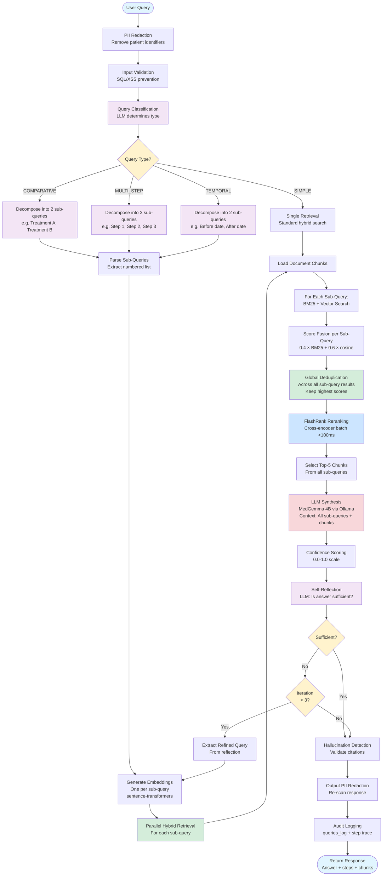

# Agentic RAG Pipeline Flow

## Overview

The Agentic RAG pipeline implements a ReAct-style reasoning system that classifies query complexity, decomposes complex queries into sub-queries, retrieves relevant context for each, and self-reflects on answer sufficiency.

## Flow Diagram



## Pipeline Stages

### 1. Security & Classification
- **PII Redaction**: Same as Classical pipeline
- **Input Validation**: Same as Classical pipeline
- **Query Classification**: LLM determines complexity type
  - **SIMPLE**: Single-concept query → skip decomposition
  - **COMPARATIVE**: "X vs Y" queries → decompose into 2
  - **MULTI_STEP**: Protocol/procedure queries → decompose into 3
  - **TEMPORAL**: Time-based queries → decompose into 2 (before/after)

### 2. Query Decomposition
- **LLM Prompt**: Task-specific decomposition instructions
- **Output**: Numbered list of sub-queries (max 4)
- **Parsing**: Regex extraction of numbered items
- **Fallback**: If decomposition fails, treat as SIMPLE

**Example Decompositions**:

| Original Query | Type | Sub-Queries |
|----------------|------|-------------|
| "Compare first-line treatments for hypertension vs diabetes" | COMPARATIVE | 1. First-line treatments for hypertension<br/>2. First-line treatments for diabetes |
| "Step-by-step protocol for acute MI management" | MULTI_STEP | 1. Initial assessment and diagnosis<br/>2. Immediate interventions<br/>3. Post-intervention monitoring |
| "What changed in diabetes guidelines from 2020 to 2023?" | TEMPORAL | 1. Diabetes guidelines 2020<br/>2. Diabetes guidelines 2023 |

### 3. Per-Sub-Query Retrieval
- **Embedding**: Generate embedding for each sub-query
- **Hybrid Search**: BM25 + vector for each sub-query independently
- **Top-K per Sub-Query**: Retrieve top-10 for each
- **Parallelization**: All sub-queries processed concurrently

### 4. Global Deduplication
- **Cross-Sub-Query**: A chunk may appear in results for multiple sub-queries
- **Deduplication Strategy**: Keep chunk with highest score across all sub-queries
- **Benefit**: Avoids redundant chunks, maximizes context diversity

### 5. LLM Synthesis with Multi-Query Context
- **Context Assembly**: All sub-queries + top-5 deduplicated chunks
- **Prompt Engineering**: Instructions to synthesize holistic answer addressing all sub-queries
- **Citations**: Must reference specific documents

### 6. Self-Reflection Loop
- **Reflection Prompt**: "Is this answer sufficient and complete?"
- **LLM Decision**: SUFFICIENT or INSUFFICIENT
- **If INSUFFICIENT**:
  - Extract refined query from reflection
  - Re-run retrieval with refined query
  - Max 3 iterations to prevent loops
- **If SUFFICIENT** or max iterations reached: Proceed to quality checks

### 7. Quality Assurance & Output
- Same as Classical pipeline:
  - Confidence scoring
  - Hallucination detection
  - Output PII redaction
  - Audit logging

### 8. Step Trace
All intermediate steps are recorded and returned:
```json
{
  "steps": [
    {"step": "classify", "type": "COMPARATIVE", "timestamp": "..."},
    {"step": "decompose", "sub_queries": ["...", "..."], "timestamp": "..."},
    {"step": "retrieve_sub_0", "chunks": 10, "timestamp": "..."},
    {"step": "retrieve_sub_1", "chunks": 10, "timestamp": "..."},
    {"step": "deduplicate", "before": 20, "after": 15, "timestamp": "..."},
    {"step": "rerank", "chunks": 5, "timestamp": "..."},
    {"step": "synthesize", "confidence": 0.92, "timestamp": "..."},
    {"step": "reflect", "sufficient": true, "timestamp": "..."}
  ]
}
```

## Performance Metrics

| Metric | Target | Typical |
|--------|--------|---------|
| Query Latency (simple) | <2s | 1.5-2s |
| Query Latency (complex) | <5s | 3-5s |
| Classification | <500ms | 200-400ms |
| Decomposition | <1s | 500-800ms |
| Retrieval (per sub-query) | <500ms | 300-400ms |
| Global Dedup + Rerank | <300ms | 150-250ms |
| LLM Synthesis | <3s | 1-2s |
| Reflection | <500ms | 200-400ms |

## Error Handling

- **Classification Failure**: Defaults to SIMPLE
- **Decomposition Failure**: Falls back to single query
- **Sub-Query Retrieval Failure**: Continue with successful sub-queries
- **Reflection Failure**: Defaults to SUFFICIENT (no retry)
- **Max Iterations Exceeded**: Return best answer so far

## Configuration

```python
# src/pipelines/prompts.py
MAX_ITERATIONS = 3        # Self-reflection retry limit
MAX_SUB_QUERIES = 4       # Maximum decomposition size

DECOMPOSE_COUNTS = {
    "SIMPLE": 1,           # No decomposition
    "COMPARATIVE": 2,      # Two-way comparison
    "MULTI_STEP": 3,       # Three-step protocol
    "TEMPORAL": 2,         # Before/after
}
```

## When to Use Agentic vs Classical

| Use Classical RAG | Use Agentic RAG |
|-------------------|-----------------|
| Single-concept queries | Comparative queries ("A vs B") |
| Straightforward clinical questions | Multi-step protocols |
| Speed-critical queries | Temporal queries ("What changed?") |
| Simple fact lookups | Complex reasoning required |
| "What is X?" | "How do X and Y differ?" |
| "Recommended dosage for Y?" | "Step-by-step guide for Z?" |

## Advantages of Agentic Pipeline

1. **Better for Complex Queries**: Decomposes multi-part questions into focused sub-queries
2. **Improved Context Coverage**: Retrieves relevant chunks for each aspect separately
3. **Self-Correction**: Reflection loop can refine query if initial answer insufficient
4. **Transparency**: Step trace shows reasoning process
5. **Holistic Synthesis**: LLM sees all sub-query context for comprehensive answer

## Trade-offs

1. **Latency**: 2-3× slower than Classical (3-5s vs <2s)
2. **LLM Calls**: 2-4× more LLM calls (classify, decompose, synthesize, reflect)
3. **Complexity**: More moving parts, harder to debug
4. **Ollama Load**: More token throughput required
