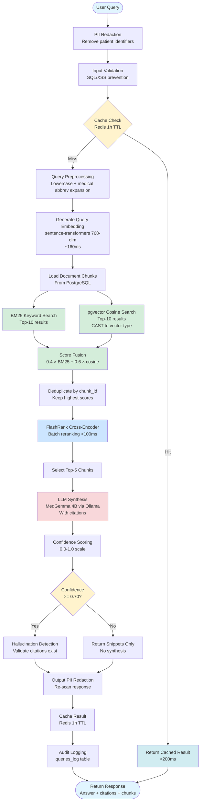

# Classical RAG Pipeline Flow

## Overview

The Classical RAG pipeline implements an advanced retrieval-augmented generation system with hybrid search, cross-encoder reranking, and comprehensive quality checks.

## Flow Diagram

## Pipeline Stages

### 1. Security & Preprocessing
- **PII Redaction**: Removes patient names, MRNs, DOBs, phone numbers, SSNs, emails
- **Input Validation**: Blocks SQL injection, XSS, malicious patterns
- **Query Preprocessing**: Lowercase normalization, medical abbreviation expansion (MI → myocardial infarction)

### 2. Caching
- **Redis Cache**: 1-hour TTL for query results
- **Cache Key**: SHA256 hash of normalized query text
- **Hit Rate Target**: >70%

### 3. Embedding Generation
- **Model**: sentence-transformers/nomic-embed-text-v1.5
- **Dimensions**: 768
- **Performance**: ~160ms per query embedding (60× faster than Ollama HTTP)
- **Prefix**: `search_query: ` for semantic differentiation

### 4. Hybrid Retrieval
- **BM25 Search**: Keyword-based retrieval with stop word removal
  - Top-10 results
  - Scores normalized to 0.0-1.0
- **Vector Search**: pgvector cosine similarity
  - SQL: `CAST(:query_vector AS vector)` for proper type handling
  - Top-10 results with `WHERE embedding IS NOT NULL`
- **Fusion**: `final_score = 0.4 × bm25_score + 0.6 × cosine_similarity`
- **Deduplication**: By chunk_id, keeping highest-scoring version

### 5. Reranking
- **Model**: FlashRank (ms-marco-MultiBERT-L-12)
- **Method**: Cross-encoder batch reranking
- **Performance**: <100ms for batch of 20 chunks
- **Output**: Top-5 re-scored chunks

### 6. LLM Synthesis
- **Model**: MedGemma 4B via Ollama
- **Context**: Top-5 chunks + metadata
- **Output**: Answer with inline citations `[Document Name, Section X]`
- **Timeout**: 30 seconds

### 7. Quality Assurance
- **Confidence Scoring**: 0.0-1.0 based on retrieval scores and LLM certainty
- **Threshold**: ≥0.70 required for synthesis, else return snippets only
- **Hallucination Detection**: Validates all citations exist in retrieval set

### 8. Output & Logging
- **Output PII Redaction**: Re-scan synthesized response
- **Result Caching**: Store in Redis for repeat queries
- **Audit Logging**: Log to `queries_log` table with execution metrics

## Performance Metrics

| Metric | Target | Typical |
|--------|--------|---------|
| Query Latency (p95) | <2s | 1.5-1.8s |
| Cached Response | <200ms | 50-150ms |
| Embedding Generation | <500ms | ~160ms |
| Retrieval + Fusion | <500ms | 200-400ms |
| Reranking | <200ms | 50-100ms |
| LLM Synthesis | <3s | 1-2s |

## Error Handling

- **Vector Search Failure**: Falls back to BM25-only retrieval
- **Ollama Unavailable**: Returns snippets without synthesis
- **No Results Found**: Returns "Insufficient information" message
- **Timeout**: 30s timeout on LLM, returns partial results

## Source Annotations

Retrieved chunks are annotated with source:
- `"bm25"`: Found by BM25 only
- `"vector"`: Found by vector search only
- `"hybrid"`: Found by both, fusion scoring applied
- `"fallback"`: Vector search failed, BM25-only used
