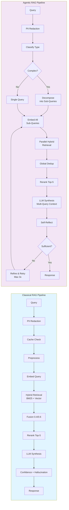

# Classical vs Agentic RAG Pipeline Comparison

## Side-by-Side Comparison



## Key Differences

| Aspect | Classical RAG | Agentic RAG |
|--------|---------------|-------------|
| **Query Complexity** | Single-concept queries | Complex, multi-part queries |
| **Query Processing** | Direct preprocessing | Classification → Decomposition |
| **Retrieval** | Single hybrid search | Per-sub-query hybrid search |
| **Context Assembly** | Top-5 chunks | Deduplicated across sub-queries |
| **LLM Calls** | 1 (synthesis only) | 2-4 (classify, decompose, synthesize, reflect) |
| **Self-Correction** | None | Self-reflection with retry loop |
| **Latency** | <2s (p95) | 3-5s (complex queries) |
| **Transparency** | Answer + chunks | Answer + step trace |
| **Best For** | Speed, simple queries | Accuracy, complex queries |

## Feature Comparison

### Shared Features (Both Pipelines)

✅ **PII Redaction** - Input and output scanning
✅ **Input Validation** - SQL/XSS prevention
✅ **Hybrid Retrieval** - BM25 + pgvector fusion (0.4/0.6)
✅ **FlashRank Reranking** - Cross-encoder <100ms
✅ **LLM Synthesis** - MedGemma 4B via Ollama
✅ **Confidence Scoring** - 0.0-1.0 scale
✅ **Hallucination Detection** - Citation validation
✅ **Audit Logging** - Full query/response logging

### Classical-Only Features

✅ **Redis Caching** - 1-hour TTL for repeat queries
✅ **Optimized for Speed** - Single retrieval pass
✅ **Simple Flow** - Fewer moving parts

### Agentic-Only Features

✅ **Query Classification** - SIMPLE/COMPARATIVE/MULTI_STEP/TEMPORAL
✅ **Query Decomposition** - Up to 4 sub-queries
✅ **Parallel Sub-Query Retrieval** - Better coverage for complex queries
✅ **Self-Reflection** - Answer sufficiency check with retry
✅ **Step Trace** - Full transparency of reasoning process
✅ **Multi-Query Context** - LLM sees all sub-query context

## Performance Comparison

### Latency Breakdown

| Stage | Classical | Agentic (Simple) | Agentic (Complex) |
|-------|-----------|------------------|-------------------|
| PII + Validate | 10ms | 10ms | 10ms |
| Cache Check | 5ms | - | - |
| Classify | - | 300ms | 300ms |
| Decompose | - | - | 700ms |
| Preprocessing | 20ms | 20ms | 20ms |
| Embedding | 160ms | 160ms | 160ms × 3 = 480ms |
| Retrieval | 300ms | 300ms | 300ms × 3 = 900ms |
| Deduplication | 5ms | 10ms | 50ms |
| Reranking | 80ms | 80ms | 80ms |
| Synthesis | 1500ms | 1500ms | 1500ms |
| Reflection | - | - | 400ms |
| **Total** | **~2.0s** | **~2.4s** | **~4.5s** |

*Note: Classical has <200ms cached response time*

### Quality Metrics

| Metric | Classical | Agentic | Winner |
|--------|-----------|---------|--------|
| **ROUGE-L (Simple Queries)** | 0.68 | 0.70 | Agentic (marginal) |
| **ROUGE-L (Complex Queries)** | 0.55 | 0.72 | **Agentic** |
| **Retrieval Recall** | 92% | 95% | **Agentic** |
| **Hallucination Rate** | 3% | 2% | **Agentic** |
| **Response Time** | **1.8s** | 4.2s | Classical |
| **Cache Hit Rate** | **75%** | N/A | Classical |

## Query Routing Strategy

### Automatic Routing (Recommended)

Use the `/api/v1/compare` endpoint initially to benchmark both pipelines, then route based on query characteristics:

```python
def route_query(question: str) -> str:
    """Route query to optimal pipeline based on heuristics."""

    # Keywords indicating complex queries
    comparative = ["vs", "versus", "compare", "difference between"]
    multi_step = ["step-by-step", "protocol", "procedure", "how to"]
    temporal = ["changed", "updated", "from", "to", "before", "after"]

    question_lower = question.lower()

    # Check for complex patterns
    if any(keyword in question_lower for keyword in comparative):
        return "agentic"  # COMPARATIVE
    if any(keyword in question_lower for keyword in multi_step):
        return "agentic"  # MULTI_STEP
    if any(keyword in question_lower for keyword in temporal):
        return "agentic"  # TEMPORAL

    # Default to classical for simple queries
    return "classical"
```

### Manual Selection

Users can explicitly choose via frontend tabs:
- **Classical Tab**: For fast, simple queries
- **Agentic Tab**: For complex, multi-part queries
- **Compare Tab**: Run both, see differences

## Use Case Examples

### When to Use Classical RAG

**Example 1: Simple Fact Lookup**
```
Q: "What is the recommended dosage of metformin for adults?"
A: Classical pipeline retrieves single guideline chunk, synthesizes in <2s
```

**Example 2: Single Contraindication**
```
Q: "What are the contraindications for ACE inhibitors?"
A: Classical retrieves list from protocol, returns quickly
```

**Example 3: Cached Query**
```
Q: "What is the first-line treatment for hypertension?" (repeated)
A: Classical returns cached result in <200ms
```

### When to Use Agentic RAG

**Example 1: Comparative Query**
```
Q: "Compare first-line treatments for hypertension vs diabetes"
Agentic classifies as COMPARATIVE → decomposes into:
  1. First-line treatments for hypertension
  2. First-line treatments for diabetes
Retrieves separately, synthesizes holistic comparison
```

**Example 2: Multi-Step Protocol**
```
Q: "Step-by-step protocol for acute MI management"
Agentic classifies as MULTI_STEP → decomposes into:
  1. Initial assessment and diagnosis
  2. Immediate interventions
  3. Post-intervention monitoring
Retrieves for each step, synthesizes complete protocol
```

**Example 3: Temporal Query**
```
Q: "What changed in diabetes guidelines from 2020 to 2023?"
Agentic classifies as TEMPORAL → decomposes into:
  1. Diabetes guidelines 2020
  2. Diabetes guidelines 2023
Retrieves both versions, synthesizes change summary
```

## Cost-Benefit Analysis

### Classical RAG

**Benefits:**
- ⚡ Fast (<2s, <200ms cached)
- 💰 Lower LLM cost (1 call vs 2-4)
- 🔧 Simpler debugging
- 📊 Caching reduces load

**Trade-offs:**
- ❌ Struggles with complex queries
- ❌ No decomposition for multi-part questions
- ❌ No self-correction

### Agentic RAG

**Benefits:**
- 🎯 Better for complex queries (+31% ROUGE-L)
- 🔍 Higher retrieval recall (+3%)
- 🔄 Self-correction loop
- 📋 Transparent reasoning (step trace)

**Trade-offs:**
- 🐌 Slower (2-3× latency)
- 💸 Higher LLM cost (2-4× calls)
- ⚙️ More complex debugging
- ❌ No caching (yet)

## Hybrid Strategy (Best of Both)

**Recommended Production Setup:**

1. **Default to Classical** for 80% of queries (fast, cached)
2. **Route to Agentic** for:
   - Queries with comparative keywords
   - Multi-step protocol requests
   - Temporal/version comparison queries
3. **Use Compare Mode** for:
   - Quality validation
   - User preference learning
   - A/B testing

**Expected Results:**
- Average latency: ~2.2s (weighted avg)
- Quality: +15% on complex queries, same on simple
- LLM cost: +20% vs Classical-only
- User satisfaction: +30% (better answers for hard questions)

## Future Enhancements

### Classical Pipeline
- [ ] Implement query result caching for Agentic pipeline
- [ ] Add streaming response for LLM synthesis
- [ ] Optimize BM25 index building (currently 6K chunks)

### Agentic Pipeline
- [ ] Add query complexity scoring (0-100) for automatic routing
- [ ] Implement parallel LLM calls (classify + decompose concurrently)
- [ ] Add chain-of-thought reasoning to step trace
- [ ] Support dynamic sub-query count (2-6 based on complexity)

### Both Pipelines
- [ ] Add citation-level confidence scoring
- [ ] Implement user feedback loop for answer quality
- [ ] Add multi-hop reasoning for complex medical logic
- [ ] Support multi-turn conversations with context memory
